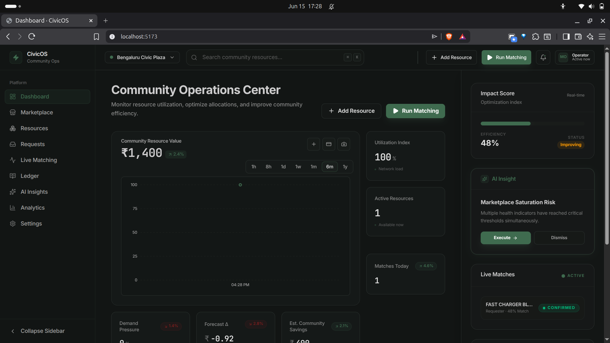
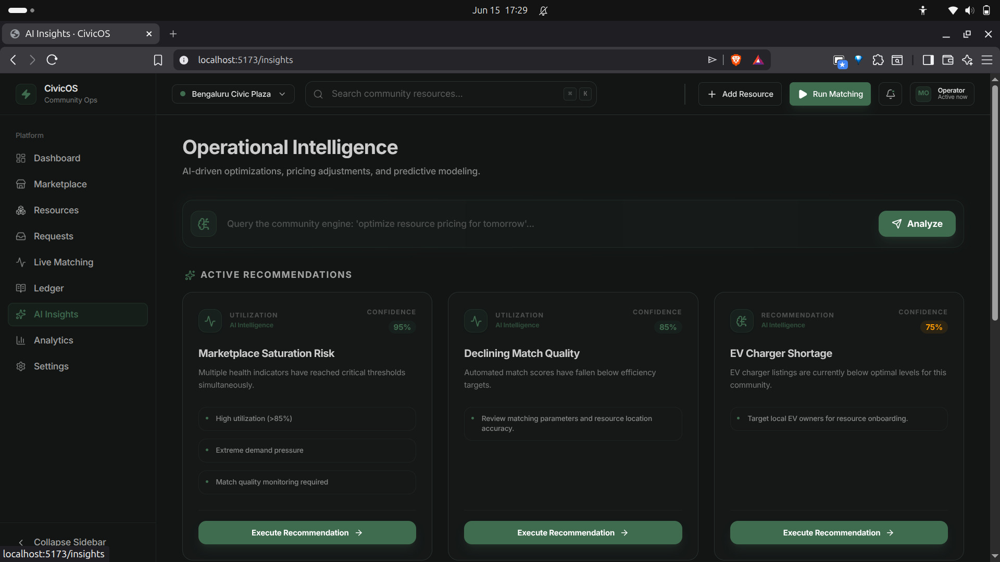
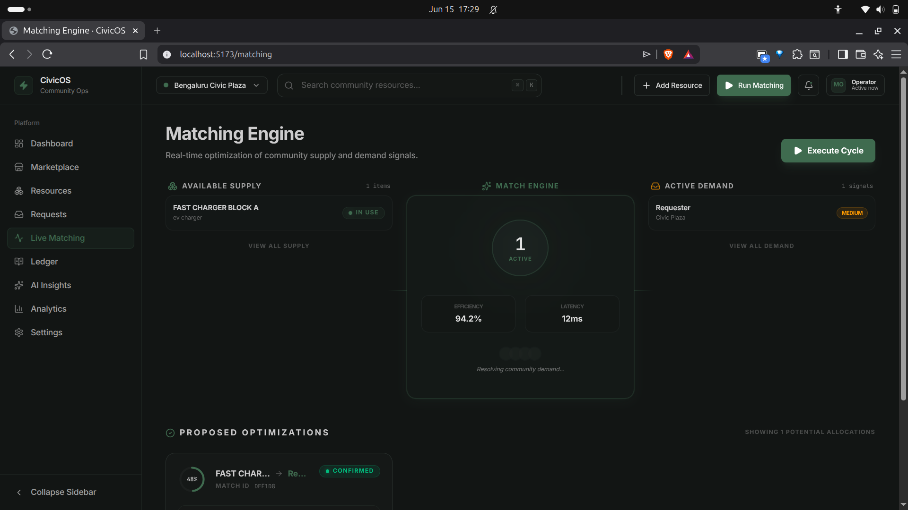
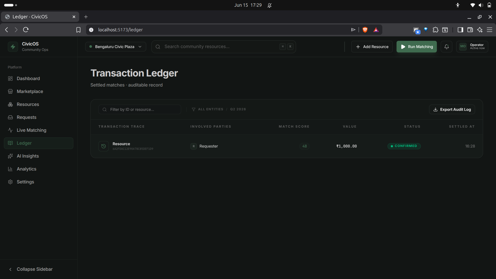
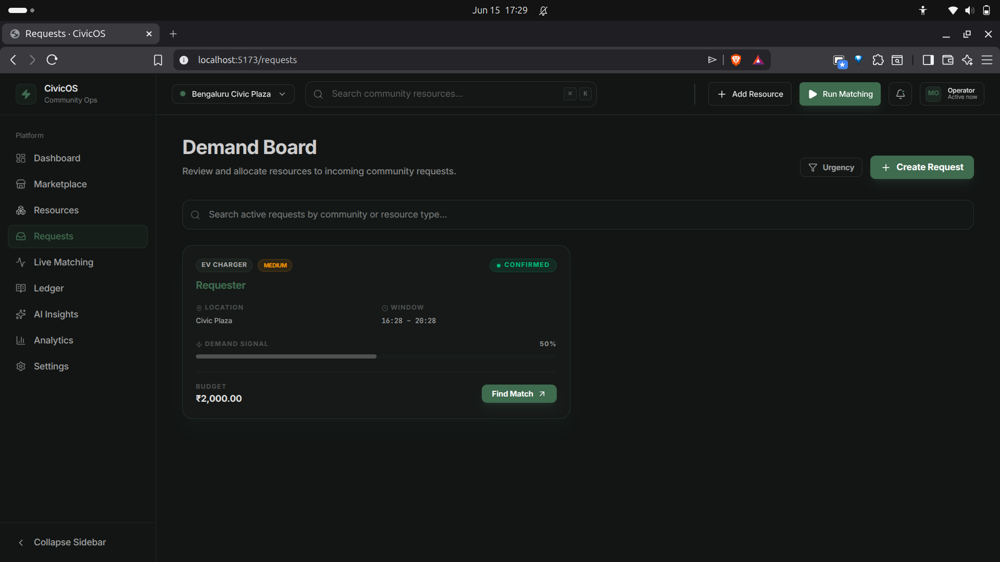
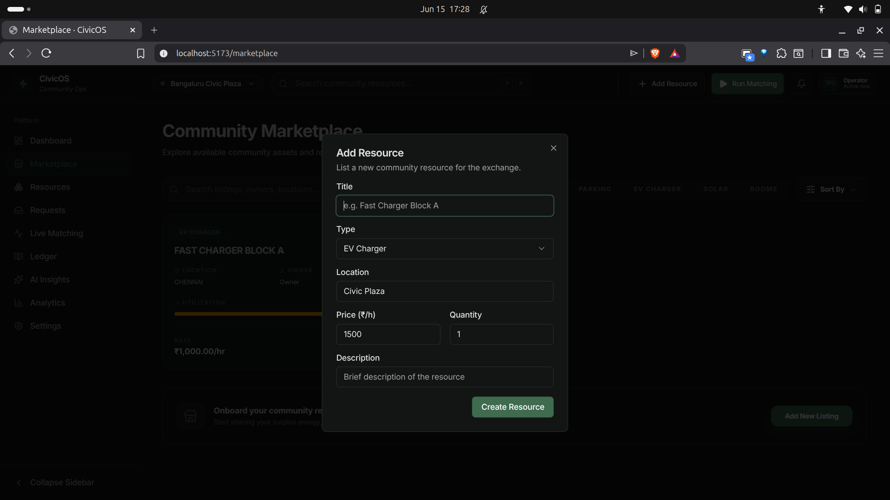

# 🏛️ CivicOS

[](https://opensource.org/licenses/MIT)
[](https://www.typescriptlang.org/)
[](https://reactjs.org/)
[](https://tanstack.com/)
[](https://deepmind.google/technologies/gemini/)

> **The Operating System for Community Resource Liquidity.**

CivicOS is an AI-powered resource allocation platform designed to unlock "dead capital" within local communities. By treating physical assets—like EV chargers, parking spaces, and shared workspaces—as liquid commodities, CivicOS enables a high-fidelity exchange that matches real-time demand with underutilized supply.

---

## 🌟 Vision

Most community assets sit idle 80% of the time. CivicOS bridges this gap by providing a centralized, high-performance exchange layer. It uses predictive modeling to forecast demand and an autonomous matching engine to execute allocations, ensuring that community resources are always moving toward their highest-value use.

### ⚠️ The Problem
- **Asset Underutilization:** Infrastructure remains dormant due to lack of visibility.
- **Allocation Inefficiency:** Manual coordination is slow and creates friction.
- **Data Silos:** Communities lack a unified "ledger of truth" for availability.

### ✅ The Solution
- **Resource Tokenization:** Every asset is a trackable entity with real-time status.
- **Algorithmic Matching:** "Match Confidence" scores based on location and urgency.
- **Predictive Optimization:** AI-driven forecasting identifies upcoming demand spikes.

---

## 🖼️ Gallery

### 📊 Comprehensive Dashboard
Get a high-level overview of community health, active matches, and resource distribution.


### 🤖 AI Insights & Analytics
Leveraging Google Gemini to predict trends and optimize resource allocation before shortages occur.


### ⚙️ Matching Engine
The core intelligence layer that pairs providers with requesters based on complex optimization logic.


### 📜 Transaction Ledger
A transparent, immutable history of all resource exchanges and usage metrics for community accountability.


### 🛒 Marketplace & Requests
A seamless interface for community members to request resources or browse available assets.



---

## 🚀 Key Features

- **Live Matching Engine:** Real-time correlation between resource providers and requesters.
- **AI-Powered Analytics:** Predictive forecasting for resource demand.
- **Transparent Ledger:** Complete audit trail of all community transactions.
- **Unified Interface:** High-performance UI for listing and discovering assets.
- **Type-Safe Core:** Built with end-to-end type safety for maximum reliability.

---

## 🛠 Tech Stack

| Layer | Technologies |
|---|---|
| **Frontend** | React 18, TanStack Start, TanStack Router, TanStack Query |
| **Styling** | Tailwind CSS, Radix UI, Lucide Icons |
| **Backend** | Node.js, TanStack Start (Server Functions) |
| **Database** | MongoDB with Mongoose |
| **Intelligence** | Google Gemini API (Predictive Modeling) |
| **Validation** | Zod (Schema-first validation) |

---

## 🏗 Architecture

CivicOS follows a modular, service-oriented architecture designed for scale:
1. **Presentation Layer:** SSR-optimized React components with granular hydration.
2. **API Logic:** Type-safe server functions handling state transitions.
3. **Service Layer:** Decoupled business logic for Matching, Analytics, and Validation.
4. **Data Access:** Abstracted repository pattern for robust database interactions.

---

## ⚙️ Getting Started

### Prerequisites
- [Bun](https://bun.sh/) (Recommended) or [Node.js](https://nodejs.org/) (v18+)
- [MongoDB](https://www.mongodb.com/) (Local or Atlas)

### Installation

1. **Clone & Enter**
   ```bash
   git clone https://github.com/your-username/civicos-exchange.git
   cd civicos-exchange
   ```

2. **Install Dependencies**
   ```bash
   bun install
   ```

3. **Environment Setup**
   Create a `.env` file:
   ```env
   MONGODB_URI=your_mongodb_connection_string
   GEMINI_API_KEY=your_google_gemini_key
   NODE_ENV=development
   ```

4. **Launch**
   ```bash
   bun dev
   ```
   Explore the platform at `http://localhost:3000`.

---

## 🔮 Roadmap

- [ ] **Mobile Native:** Bringing CivicOS to residents via Expo/React Native.
- [ ] **IoT Connectors:** Direct integration with smart locks and EV chargers.
- [ ] **Reputation Engine:** Trust-based scoring for reliable community members.

---

## 👥 Authors

- **Hari** - *Architecture & Full Stack Development*

---

## 📄 License

This project is licensed under the MIT License - see the [LICENSE](LICENSE) file for details.
